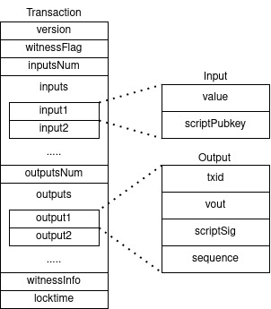
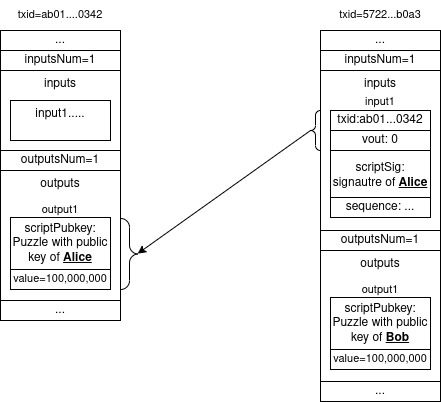
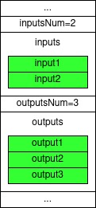
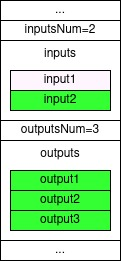
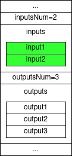
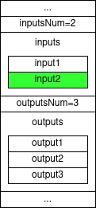
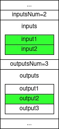
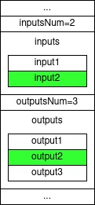
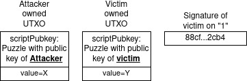

# One *Single* Trick To Lose Your Coins

While implementing some code relating to Bitcoin's P2P network security I've stumbled upon a long standing issue in Bitcoin caused by no other than Satoshi himself.

To better explain it we'll first have to get acquainted a little bit deeper with Bitcoin's transaction format.
So a bitcoin transaction has the following fields.

1. `version`.
1. `witnessFlag`, optional.
1. `inputsNum`, the number of inputs in the transaction.
1. `inputs`, an array of length `inputsNum` describing the inputs of the transaction.
1. `outputsNum`, the number of outputs in the transaction.
1. `outputs`, an array of length `outputsNum` describing the outputs of the transaction.
1. `witnessInfo`, optional, exists only if `witnessFlag` is specified.
1. `locktime`, can be used to apply some restrictions on the outputs of this transaction.

We will not be explaining the meaning of all fields with all edge cases involved, but the general sense you should get is that transactions are typically the conversion of a set of existing unspent-transaction-outputs (UTXOs) into a set of new UTXOs.

The existing UTXOs, spent in the transaction are referred to as the inputs of the transaction.
When creating a transaction, we specify in field 3 the number of inputs and in field 4 the inputs themselves.
Similarly, new UTXOs, created in the transaction are referred to as the outputs of the transaction.
Thus, when creating a transaction, we specify in field 5 the number of outputs and in field 6 the outputs themselves.

Let's looks on the inside of those inputs and outputs and what information is required to encode them.
We shall begin with outputs since they are simpler and contain fewer pieces of information.
An output of transaction contains the following two attributes:

1. `value`, how many satoshies are stores in this output.
1. `scriptPubkey`, who can spend the coins in this output.

While the `value` attribute is easy to grasp, you can think of the `scriptPubkey` attribute as a puzzle that whoever wants to spend this output has to solve.
When you're sending some coins to your friend, she gives you her Bitcoin address, this address is directly decoded in this `scriptPubkey` address, so your Bitcoin wallet will specify in the output a puzzle that only your friend can solve, using her private key.
This puzzle is specified under the hood using a "programing language" dedicated to Bitcoin call "script".
You can find further information about Bitcoin script [here](https://en.bitcoin.it/wiki/Script).

Great, now let's move to the inputs.
An input contains the following five fields:

1. `txid`, the hash of the transaction which contains the output were are spending in this input.
1. `vout`, the transaction with hash `txid` may contain multiple outputs, this field specifies which of the outputs of that transaction are we spending in this input.
1. `scriptSig`, the solution to the puzzle of the output being spent, which typically includes a digital signature.
1. `sequence`, used for RBF signalling, irrelevant for this article.
1. `witness`, another more efficient way to solve the puzzle which we'll not get into in this article.

With all given information, the following is a schematic format of the transaction:



Let's have an example, consider Alice has 1 BTC she received at transaction with txid `ab01...0342` (we'll be using abbrivated notation instead of writing a long transaction ID).
Thus, this transaction has a single output worth 1 BTC which can only be spent using Alice's private key.
Alice wants to send this 1 BTC to Bob.
To do so, she asks from Bob for his addres which encompoasses Bob's public key.
Next, she creates a transaction with a single input, referring to the first out output from transaction previous transaction (so `vout = 0` and `txid = ab01...0342`), she computes her signature using her private key this input, thereby authorizing the payment and attaches it to the `scriptSig` field in the input.
In the output of the transaction she creates a single output with `value = 100,000,000`, which are 100,000,000 satoshis, that is single BTC and is writing Bob's public key in the `scriptPubkey` field.

The result transaction, ignoring irrelevant fields looks something like this:



Now that we know rougly how transactions work, let's get a little bit deeper into the `scriptSig` field.
In our previous example Alice was computing a signature of the transaction she was sending to Bob.
Digital signatures (such as ECDSA signatures used in Bitcoin) are considered hard to forge without owning the private key.
That means that without the private key an attacker using Alice's previous signatures will not be able to generate a new signature authorizing the spending of one of her UTXOs.
When computing a digital signature, the signing procedure typically takes an arbitrarily sized buffer, compute the hash of the contents of this buffer and employ the mathematical procedure on the hash of the message.
So, when Alice is computing the digital signature, what exactly is this buffer that will be passed into the signing procedure?
The most common case is that all contents of the transaction (besides the signature itself, of course) are signed, this is probably what you would expect and even implement your self if you were trying to write your own version of Bitcoin.
However, in Bitcoin other modes are available which allow the spender to sign only part of the information in the transaction to allow higher degrees of freedom and perhaps more sophisticated use cases.
The exact mode comes right after the digital signature iin the `scriptSig` field and is encoded using a single byte known as a `SIGHASH_TYPE`.

## SigHash Types

So we already know that there is a piece of information encoded in the `scriptSig` field of each input of a transaction that is responsible to dictate what pieces of information in the transaction will the spender sign on.

One common feature to all possible modes is that the input being spent (i.e. the input for which we compute the `scriptSig`) is being signed.
There are six possible options for the `sighash` byte which will be introduced using the following scenario.
Let's say we have a transaction with two inputs and three outputs and we are computing the signature for the `scriptSig` in the second input.
In the following we present all sighash types accompanies with a visual of the said transaction where the inputs / outputs that are signed are colored in green.

### SIGHASH_ALL

The first sighash type is `SIGHASH_ALL` in which the all inputs and all outputs of the transaction are signed.



### SIGHASH_ALL | SIGHASH_ANYONECANPAY

In this sighash type all outputs are signed but the `SIGHASH_ANYONECANPAY` signifies that only one of the inputs is signed, that is the input for which this sighash type is specified in.
This means, as its name suggests that anyone else who has this transaction can join and add inputs to this transaction as long as it preserves the same outputs that are signed.
In other words, since the spender isn't signing other inputs except his own input, anyone else can take this transaction and modify it by adding another input as long as he doesn't modify the outputs that are provided with the original transaction.



### SIGHASH_NONE

In this sighash type none of the outputs is signed and all inputs are signed.
Therefore, when signing an input using this sighash type, the spender is saying "I'm OK with spending this input as long as the other inputs which I'm signing on are also spent. I'm also OK that the coins associated with this input will be sent to wherever the other spender decide".



### SIGHASH_NONE | SIGHASH_ANYONECANPAY

In this sighash type none of the outputs is signed and only the input being spent is signed.
Therefore, when signing an input using this sighash type, the spender is say "I'm OK with spending this input and I really don't care what will eventually happen with it".
Anyone who receives such an input can take it and do spend it in any way the see fit. This is because the sighash doesn't apply and constraints on any other input or output in the transaction.
What you may expect to happen eventually is that the miner who sees a transaction containing such a sighash type, to take the input to himself.




### SIGHASH_SINGLE

In this sighash type all inputs are signed and only one output is signed.
Namely, if we are trying to spend input number 2 (therefore, computing the `scriptSig` for that input), we will sig on the output with the matching index, in our case that would be output number 2.
When spending such an input the spender is say "I'm OK with spending this input in any transaction who contains this specific output and as long as all other inputs who I'm signing on are also taking part in the transaction".
The other parties signing the rest of the inputs can add outputs to the transaction as they see fit, as long as the value of all outputs isn't above the value of all inputs, of course.



### SIGHASH_SINGLE | SIGHASH_ANYONECANPAY

In this sighash type, only one input is signed and one output is signed.
Just like `SIGHASH_SINGLE`, the output which will be signed is the output with the matching index to the index of the input being signed.
When spending an input using this sighash the spender is saying "I'm OK with spending this input in any transaction who also contains this output on which I'm signing".



## The Bug

Now we know what is a sighash and what are the six types of sighashes it's time to share the bug with you.
The issue lies within the definition of `SIGHASH_SINGLE` and `SIGHASH_SINGLE | SIGHASH_ANYONECANPAY`.
Specifically, both sighash types sign a signle output with the matching index as the index of the input for which this sighash mode is specified.
But what if no such output exists?
What do we hash in that case?
Well, this is a great question so please first stop and try to think what you might have expected to happen in such a scenario.
While you have probably thought of either forbidding such transactions to be mined (as part of Bitcoin's concensus rules) or simply interpret the sighash type as `SIGHASH_NONE` or `SIGHASH_NONE | SIGHASH_ANYONECANPAY`, hereby signing only on the inputs, neither of these is what actually happening.
What happens is, the signature simply signs the hash of the 256-bit little-endian number "0000...0001", which we will simply call "1" for the sake of brevity.
That is, while typically messages are hashed and signed, in this case no message is provided and the signing algorithm is directly given the said value of "1".
Can you think of any meaningful implication for this?

### So what?

The most prominent implication of this behavior, is that if an attacker manages to obtain, by any mean, the signature of "1" from your private key, he will immediately gain indefinite access to your account.
In other words, if you publish a signature on the hash value "1", you can kiss goodbye to all your funds from the associated address.
Why is that?
How can this be exploited?
If you publish a signature on hash "1" using the secret key associated with your Bitcoin address, the attacker can take this signature, stick it in the `scriptSig` field of an input with sighash type of `SIGHASH_SINGLE` and place this input as the second input in a transaction with two inputs, where the first input would be any UTXO owned by the attacker which the attacker can spend.
The single output of this transaction will be destined to the attacker with all value from both inputs (his own input and the victim's input) sent to him.
Let's visualize the attack and examplify it, consider we have a victim with some UTXO owned by him with value of `Y` satoshis and we have a signature of the victim on the hash value "1".
On the side there's an Attacker with a UTXO owned by him with value of `X` satoshis.
The "ingredient" for the attack, therefore, would look like this:



The attacker, using his private key and these inputs will create the following transaction:


## Did Satoshi Really Create This Bug?

Yes, this bug was created by no other than the legendary Satoshi Nakamoto, go ahead and look at it yourself.
To do so, download the first version of Bitcoin's v0.1.0 source code from Nakamoto Institute using [this link](https://satoshi.nakamotoinstitute.org/code/).
Navigate to `script.cpp` file at line 818 you can find the `SignatureHash` function containing the following piece of code:

```cpp
uint256 SignatureHash(CScript scriptCode, const CTransaction& txTo, unsigned int nIn, int nHashType)
{
    if (nIn >= txTo.vin.size())
    {
        printf("ERROR: SignatureHash() : nIn=%d out of range\n", nIn);
        return 1;
    }
    //...Some irrelevant code...
}
```

As you can see, if the variable `nHashType & 0x1f` is equal to `SIGHASH_SINGLE` then the given input we are processing contains a signature with sighash of type `SIGHASH_SINGLE`, so we're looking for the matching output and if it doesn't exist, we return the value `1` as an error code.
Next, the `SignatureHash` function is called from the `CheckSig` function (also at `script.cpp` line 881)

```cpp
bool CheckSig(vector<unsigned char> vchSig, vector<unsigned char> vchPubKey, CScript scriptCode,
              const CTransaction& txTo, unsigned int nIn, int nHashType)
{
    // ...Some irrelevant code...
    if (key.Verify(SignatureHash(scriptCode, txTo, nIn, nHashType), vchSig))
        return true;

    return false;
}
```

So as part of the signature checking the code was calling the `SignatureHash` function and sent its output value directly to the `key.Verify` function without checking for the error code.
Because of this bug, the consensus of Bitcoin allows for inputs signed with SIGHASH_SINGLE to be the ECDSA signature with the private key on the hash of the 256-bit value of 1.

## Mitigations